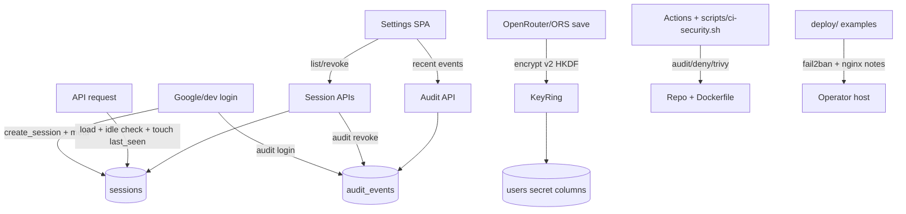

# Security P2 — Design

Date: 2026-08-04  
Status: Approved  
Source: Deferred items from `.junie/plans/security-hardening-p0-p1.md` (Out of Scope P2)

## Goals

Implement all five deferred P2 security items as one **integrated security pack**:

1. Session revoke-all UI / multi-device session list
2. Idle timeout productization (soft idle; **no** hard IP binding)
3. HKDF + encrypted-key versioning / rotation (pragmatic; no live re-encrypt job)
4. Structured audit-log product + WAF/fail2ban **edge samples** (not in-app WAF)
5. CI `cargo audit` / image scanning (GitHub Actions **and** local scripts)

Preserve existing product behavior (Google login, device ingest, photos, trips, routes, AI).

## Non-goals

- Hard IP binding of sessions
- Live re-encryption / admin rewrap job for all secrets
- Full admin audit explorer, retention policies, export
- Running WAF or fail2ban inside `docker-compose` by default

## Architecture



Shared helpers:

- Client IP: reuse rate-limit / `TRUST_FORWARDED_HEADERS` logic
- `audit::record(...)` — await insert; on failure `tracing::warn!`, do not fail primary action
- `crypto::KeyRing` — current + optional previous env key; versioned encrypt/decrypt

## Data model

### Migration `006_security_p2.sql`

**`sessions` columns added**

| Column | Type | Notes |
|--------|------|--------|
| `created_at` | `TIMESTAMPTZ NOT NULL DEFAULT now()` | |
| `last_seen_at` | `TIMESTAMPTZ NOT NULL DEFAULT now()` | Idle sliding base |
| `ip` | `TEXT` | Display only |
| `user_agent` | `TEXT` | Display only |

`expires_at` remains **absolute** expiry.

**`audit_events`**

| Column | Type |
|--------|------|
| `id` | `UUID PK` |
| `user_id` | `UUID NULL` |
| `actor_session_id` | `TEXT NULL` |
| `action` | `TEXT NOT NULL` |
| `resource_type` | `TEXT NULL` |
| `resource_id` | `TEXT NULL` |
| `ip` | `TEXT NULL` |
| `user_agent` | `TEXT NULL` |
| `meta` | `JSONB NOT NULL DEFAULT '{}'` |
| `created_at` | `TIMESTAMPTZ NOT NULL DEFAULT now()` |

Index: `(user_id, created_at DESC)`.

**Example actions:** `auth.login`, `auth.logout`, `session.revoke`, `session.revoke_others`, `session.revoke_all`, `settings.openrouter_updated`, `settings.ors_updated`, `share.created`, `share.revoked`, `device.created`, `device.revoked`.

**Encrypted secrets versioning** (OpenRouter / ORS columns on `users` or existing settings tables):

- Add `*_key_version INT NOT NULL DEFAULT 1` beside each ciphertext pair as needed
- `1` = legacy `SHA-256(SECRETS_KEY)` AES-GCM key (existing rows)
- `2+` = `HKDF-SHA256` derived key with domain-separated info (e.g. `ctp-secrets-v2`)
- New writes stamp `SECRETS_KEY_VERSION` (default `2`)

## Config

| Env | Default | Purpose |
|-----|---------|---------|
| `SESSION_IDLE_HOURS` | `168` (7d) | Soft idle TTL |
| `SESSION_ABSOLUTE_DAYS` | `14` | Absolute cookie/DB expiry |
| `SECRETS_KEY_VERSION` | `2` | Version stamped on new ciphertext |
| `SECRETS_KEY_PREVIOUS` | unset | Prior env material for decrypt during rotation |
| `TRUST_FORWARDED_HEADERS` | existing | Client IP for sessions + audit |

## Session behavior

**Create** (`create_session`): generate id; set `expires_at = now + absolute`; store `ip`, `user_agent`, timestamps; set cookie max-age = absolute.

**Load** (`load_session_user`):

1. Missing row → unauthorized  
2. `expires_at < now` → delete row → unauthorized  
3. `last_seen_at + idle < now` → delete row → unauthorized  
4. Touch `last_seen_at` if older than ~60s (avoid write amplification)  
5. Absolute `expires_at` does **not** slide

**IP:** stored and shown; never used to reject requests.

## HTTP API

All require session auth unless noted.

| Method | Path | Behavior |
|--------|------|----------|
| `GET` | `/api/me/sessions` | List caller’s sessions; `current` flag for cookie session |
| `DELETE` | `/api/me/sessions/{id}` | Revoke one owned session; if current, clear cookie |
| `POST` | `/api/me/sessions/revoke-others` | Delete all except current |
| `POST` | `/api/me/sessions/revoke-all` | Delete all + clear cookie |
| `GET` | `/api/me/audit?limit=` | Recent events for user; default 50, max 100 |

Session list DTO fields: `id`, `created_at`, `last_seen_at`, `expires_at`, `ip`, `user_agent`, `current`.

## Crypto contract

```text
KeyRing { current, previous?, current_version }

encrypt_secret(plain, &KeyRing) -> (nonce, ciphertext, key_version)
decrypt_secret(nonce, ct, key_version, &KeyRing) -> String
```

Decrypt:

- `key_version == 1`: legacy SHA-256 derive with current, then previous if set  
- `key_version >= 2`: HKDF derive with current, then previous  

Document operator rotation:

1. Set `SECRETS_KEY_PREVIOUS` = old key, `SECRETS_KEY` = new key  
2. Restart; old v2 blobs still decrypt via previous  
3. Optional later: users re-save keys to rewrap at current version (no mandatory job)

## SPA (Settings)

File: `crates/web/src/pages/settings.rs` (+ `api.rs`).

1. **Active sessions** card — list with “This device”, relative times, IP, UA; Revoke / Revoke others / Sign out everywhere (confirm bulk).  
2. **Security activity** card — last ~50 humanized audit rows; read-only.

## Ops samples

Under `deploy/`:

- `fail2ban/jail.local.example` + filter for auth/ingest 401/429 bursts  
- `nginx-security.conf.example` — proxy rate zones, pointer to optional WAF  

Linked from README security section; not enabled by default compose.

## CI

- `scripts/ci-security.sh` — `cargo audit` and/or `cargo deny`; Trivy when installed; clear skip messages  
- `.github/workflows/security.yml` — PR + weekly: Rust advisories + Dockerfile/fs Trivy  
- README: how to run locally

## Testing

- Crypto: legacy v1 roundtrip, v2 HKDF roundtrip, previous-key decrypt, wrong key fails  
- Session policy: absolute + idle expiry helpers; touch throttle behavior  
- API: list isolation; revoke-others keeps current; revoke-all clears current  
- Audit: record helper does not fail caller when insert errors (unit with mock or integration)  
- `cargo test -p server`; Trunk build still valid after Settings API use

## Risks

| Risk | Mitigation |
|------|------------|
| last_seen write amp | Touch only if ≥60s stale |
| Audit breaks login | Warn-only on audit failure |
| HKDF breaks old secrets | Version column + v1 path |
| Session id in UI | Owner-only over authenticated session |
| CI tool missing locally | Script degrades gracefully; CI installs tools |

## File touch list (expected)

- `migrations/006_security_p2.sql`
- `crates/server/src/config.rs`, `crypto.rs`, `auth/session.rs`, `auth/mod.rs`, `auth/google.rs`
- `crates/server/src/audit/mod.rs` (new)
- `crates/server/src/lib.rs`, middleware IP helper reuse
- Share/device/settings handlers for audit hooks
- `crates/web/src/api.rs`, `pages/settings.rs`
- `deploy/*`, `scripts/ci-security.sh`, `.github/workflows/security.yml`
- `.env.example`, `README.md`
