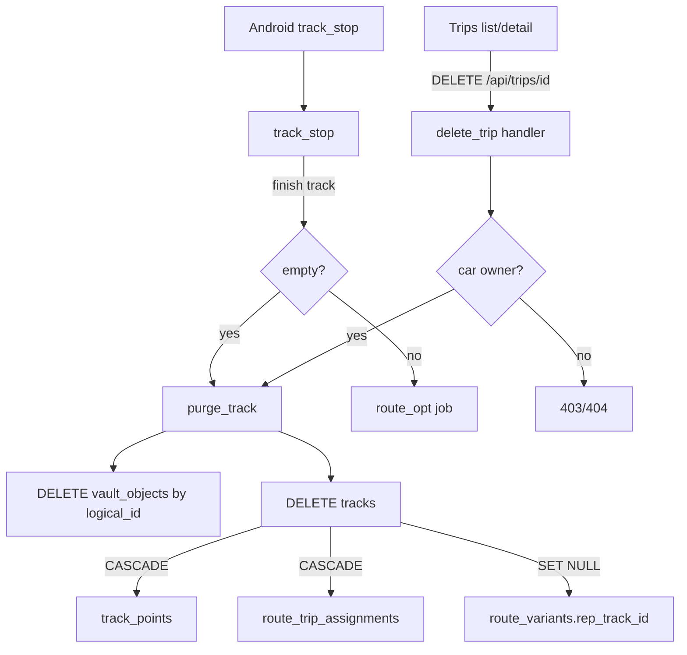

# Trip Delete & Empty-Trip Auto-Remove — Design

Date: 2026-08-05  
Status: Approved  
Source: Product request — remove trip + cascade; drop empty trips on end

## Goals

1. **Manual delete:** Car **owner** can permanently delete a trip and all data referenced by that trip.
2. **Auto-remove:** When a trip **ends** (device `track_stop`) with **zero or one** point, automatically remove it so empty/noise trips never linger.
3. **Web UX:** Delete available from trips list and trip detail, with confirm.
4. **Vault-aware:** Ciphertext objects keyed by track id are removed with the trip.

## Non-goals

- Soft delete / trash / undo
- Recalculating route corridor `trip_count` immediately after every delete
- Allowing editors/viewers to delete trips
- Client-side decrypt to measure vault point counts for auto-remove
- Bulk multi-trip delete UI

## Decisions (locked)

| Topic | Choice |
|-------|--------|
| Who can delete | **Owner only** (same as delete car) |
| Empty definition | **0 or 1 plaintext point**, and **no** vault `track_points_chunk` rows |
| Structure | **Shared `purge_track` helper** |
| UI | **Web + API** (list + detail) |
| Delete style | Hard delete |

### Empty-trip auto-remove rule (precise)

After `track_stop` marks the track finished:

```text
plaintext_n = COUNT(*) FROM track_points WHERE track_id = ?
vault_chunks = COUNT(*) FROM vault_objects
               WHERE logical_id = ? AND object_type = 'track_points_chunk'

purge if: vault_chunks == 0 AND plaintext_n <= 1
```

Rationale: server cannot decrypt vault chunks; a single chunk may hold many points, so any vault chunk keeps the trip. Plaintext trips with 0–1 GPS samples are discarded as non-trips.

## Architecture



### Shared helper: `purge_track`

Location: `crates/server/src/trips/` (or small internal module used by trips + ingest).

Steps (single transaction preferred):

1. `DELETE FROM vault_objects WHERE logical_id = $track_id`  
   Covers `track_meta`, `track_points_chunk`, `ai_report` (and any future types using track id as `logical_id`).
2. `DELETE FROM tracks WHERE id = $track_id`  
   Relies on existing FKs:
   - `track_points.track_id` → `ON DELETE CASCADE`
   - `route_trip_assignments.track_id` → `ON DELETE CASCADE`
   - `route_variants.rep_track_id` → `ON DELETE SET NULL`
3. Analysis columns live on `tracks` and go away with the row.

No new migration required unless we later want an explicit FK from vault_objects to tracks (not in v1; vault is intentionally loose by design).

### Manual API

- **Route:** `DELETE /api/trips/{id}` on trips router (alongside existing GETs).
- **Auth:** session `AuthUser`.
- **Authz:** load track → car → `require_owner(pool, user.id, car_id)`.
- **Missing / not accessible as owner:** `404` (do not leak existence to non-owners) or `403` if readable but not owned — prefer **404 for non-owner** consistency with sensitive resources, or **403** if already visible via list. **Prefer:** if track not found or user is not owner → `NotFound` (same pattern as owner-only car ops when require_owner fails — match existing `require_owner` error).
- **Success:** `{ "ok": true }`, audit `trip.deleted` with `resource_type=trip`, `resource_id=track_id`, meta may include `car_id`.
- **Idempotency:** second delete → 404.

### Auto-remove on stop

In `track_stop` (`crates/server/src/ingest/mod.rs`), after successful finish update:

1. Resolve `track_id` (already done for route-opt).
2. Evaluate empty rule.
3. If empty → `purge_track`; **do not** spawn route-opt.
4. If not empty → existing route-opt spawn.
5. Always return `200 OK` to device whether purged or finished.

### Web UI

- `delete_trip(id)` in `crates/web/src/api.rs`.
- **List** (`TripsPage`): per-row delete control; `stopPropagation`; browser `confirm` or small modal.
- **Detail** (`TripDetail` / equivalent): Delete in header actions; on success navigate to `/trips`.
- Disable while in flight; surface API errors.
- Ownership: show delete for all listed trips; API enforces owner-only (list already only shows accessible cars; shared viewers may see the button and get an error — acceptable). Optional polish: hide if not owner when ownership field exists; not required for v1.

## Data touched on purge

| Data | Handling |
|------|----------|
| `tracks` | DELETE |
| `track_points` | CASCADE |
| `route_trip_assignments` | CASCADE |
| `route_variants.rep_track_id` | SET NULL |
| `vault_objects` (logical_id = track) | Explicit DELETE |
| Analysis on track row | Deleted with track |
| Corridors / variants / insights | Kept (may become slightly stale counts) |

## Error handling

| Case | Behavior |
|------|----------|
| Unauthenticated | 401 |
| Not owner / unknown id | NotFound or Forbidden per `require_owner` |
| DB failure | 500 |
| Device stop, track missing | existing 404 |
| Device stop, empty purge fails | log error; still return 200 if finish succeeded (or fail stop — prefer log + 200 finish already applied; better: run purge in same request and if purge fails return 500 after finish — simplest: finish then purge best-effort with warn log, still 200) |

**Locked for implement:** finish first; if empty and purge fails, `tracing::warn` and return 200 (device should not retry forever). Manual delete surfaces DB errors.

## Testing

1. **Manual delete (integration):** owner creates track (+ points optional) → DELETE → track, points, vault objects gone; non-owner DELETE fails.
2. **Auto-remove 0 points:** start track, stop without samples → no track row.
3. **Auto-remove 1 point:** one sample then stop → purged.
4. **Keep 2+ points:** two samples then stop → track finished, not deleted.
5. **Vault:** track with `track_points_chunk` and 0 plaintext → stop does **not** purge; manual DELETE removes vault rows for that logical_id.

## Implementation touchpoints

- `crates/server/src/trips/mod.rs` — route + handler + `purge_track`
- `crates/server/src/ingest/mod.rs` — empty check on stop
- `crates/server/src/audit/mod.rs` — `TRIP_DELETED` action constant
- `crates/web/src/api.rs` — `delete_trip`
- `crates/web/src/pages/trips.rs` — list + detail UI
- `crates/server/tests/ingest.rs` (and/or new trips test) — coverage above

## Out of scope follow-ups

- Decrement `route_variants.trip_count` / rebuild insights on delete
- Soft-delete recovery window
- Android UI for delete (API sufficient; device only needs stop auto-remove)
